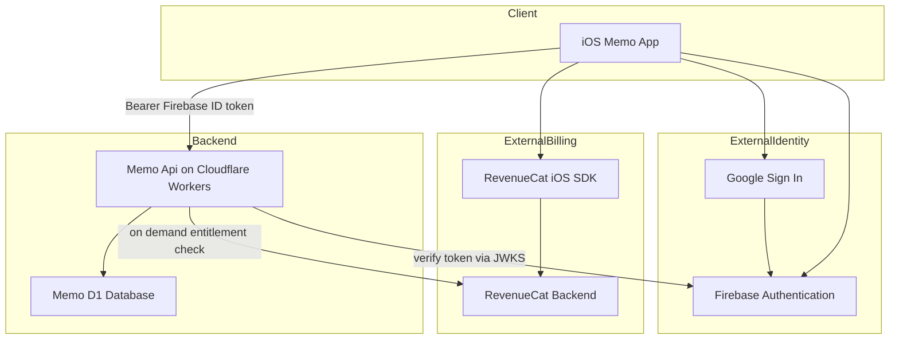
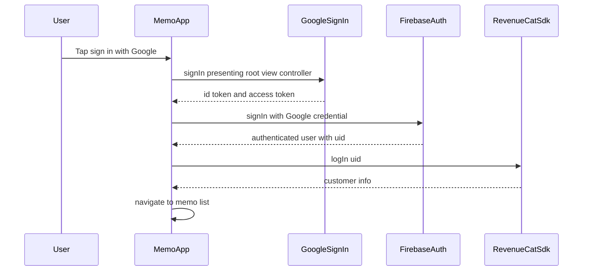
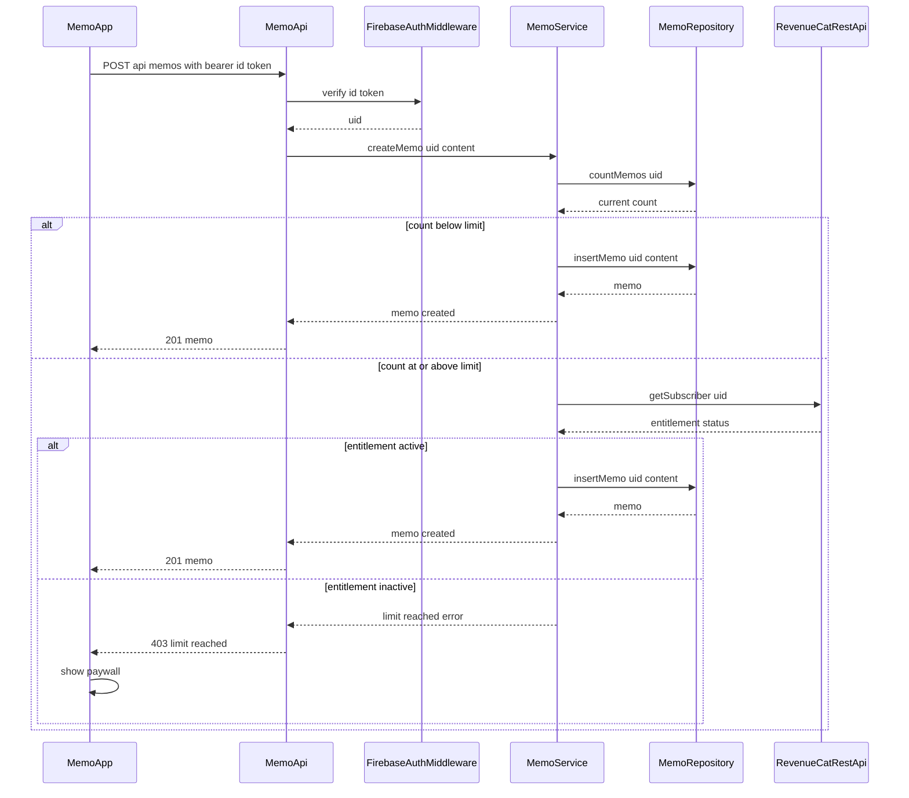

# Design Document

## Overview

**Purpose**: 本機能は、Googleサインインによる認証・自前バックエンドAPI・RevenueCatによるサブスクリプション課金を組み合わせたメモ帳アプリケーションを提供する。Shipaton参加に向けた練習の一環として、これまでこのリポジトリで経験していなかった「認証されたユーザーが自分のデータのみを操作でき、無料利用には制限があり、課金によってその制限が解除される」というフルスタックパターンを実現する。

**Users**: このリポジトリの開発者自身(練習用途)が、iOSクライアントを通じてメモを作成・管理し、無料枠を超えたら購入フローを試す。

**Impact**: 新規機能であり、既存の `my_first_swift_project` / `my_first_game` には影響しない。リポジトリ直下に新しいトップレベルディレクトリ `memo_app/`(iOSクライアント)と `api/`(バックエンド)を追加する。

### Goals
- Googleサインインで認証されたユーザーだけがメモを作成・閲覧・編集・削除できる。
- 無料プランのユーザーはメモ件数に上限があり、上限到達で購入導線が提示される。
- RevenueCatでの購入・復元により、サーバー側で強制されているメモ件数上限が解除される。
- 認証・自前API・課金を1つのアプリで連携させる、未経験だったフルスタックパターンを実践する。

### Non-Goals
- Google以外のサインイン方法(Sign in with Apple、メール/パスワード等)のサポート。
- オフライン編集・ローカルキャッシュ・複数端末間リアルタイム共同編集。
- メモの共有・公開機能、画像等リッチコンテンツ添付。
- RevenueCat Webhookを使ったサブスクリプション状態の非同期同期(オンデマンドAPI呼び出しで代替する。将来の拡張候補として `research.md` に記録)。
- Android/Flutterクライアントからのこのバックエンドの利用(将来的な拡張候補だが今回のスコープ外)。

## Boundary Commitments

### This Spec Owns
- iOSクライアント(`memo_app/`)におけるGoogleサインインの実行、セッション状態管理、サインアウト。
- メモのCRUD操作と、その所有者チェック(本人のメモのみ操作可能)。
- 無料プランのメモ件数上限の判定とその強制(サーバー側)。
- RevenueCatの購入・復元UIフローと、それによるメモ件数上限解除への反映。
- バックエンド(`api/`)のFirebase IDトークン検証ミドルウェアと、D1を用いたメモ永続化。

### Out of Boundary
- Firebase Authentication自体の内部実装(アカウントストレージ、トークン発行、Google OAuth同意画面)。
- App Store課金処理やRevenueCatのレシート検証パイプラインの内部実装。
- Google以外のサインイン方法、オフライン編集、複数端末リアルタイム共同編集、メモ共有、リッチコンテンツ(要件のBoundary Contextと同一)。
- `api/` に将来追加されるかもしれない、メモ帳機能以外の横断的なバックエンド規約(本specはメモ帳機能に必要な範囲のみを所有する)。

### Allowed Dependencies
- Firebase Authentication(Googleサインインプロバイダ) — クライアント側は `FirebaseAuth` / `GoogleSignIn` の2つのSPMパッケージのみに依存し、`firebase-admin` には依存しない。
- RevenueCat — クライアント側はiOS SDK(`purchases-ios`、既存 `my_first_swift_project` と同じ依存形態)、サーバー側はRevenueCat REST API v1(`GET /v1/subscribers/{app_user_id}`)のみに依存する。
- Cloudflare D1 — メモデータの唯一の永続化層。`MemoRepository` を経由してのみアクセスする。
- Cloudflare Workers / Hono ランタイムおよびその組み込み `hono/jwk` ミドルウェア。

### Revalidation Triggers
- FirebaseプロジェクトIDやJWKS URL/issuerなど、トークン検証に使う値の変更。
- メモ件数上限を解除するRevenueCatエンタイトルメントIDの変更、またはRevenueCat REST APIのv1からv2への切り替え。
- 無料プランのメモ件数上限値、またはその強制ポイント(クライアント側判定への移行など)の変更。
- 2つ目のサインイン方法や、Android/Flutterなど2つ目のクライアントプラットフォームがこのバックエンドを共有する状況の発生。
- オンデマンドRevenueCat照会から、Webhook同期方式への切り替え(新たなデータ所有権=購読状態が発生するため)。

## Architecture

### Architecture Pattern & Boundary Map



**Architecture Integration**:
- **Selected pattern**: クライアント(iOS) + ステートレスREST API(Hono on Workers) + リレーショナルストレージ(D1)の薄いレイヤード構成。要件数が少ないため、過剰な抽象化(Durable Objects、Webhookレシーバー等)は採用しない(`research.md` Architecture Pattern Evaluation参照)。
- **Domain/feature boundaries**: 認証(Auth)、メモ(Memos)、課金(Billing)をクライアント・バックエンド双方でモジュールとして分離し、責務が混ざらないようにする。
- **既存パターンの踏襲**: RevenueCatラッパーは `my_first_swift_project/Sources/Services/PurchaseService.swift` の `enum` + `static async` 関数というパターンを踏襲する。
- **新規コンポーネントの理由**: バックエンド(`api/`)は本specで初めて作られるため、Firebase IDトークン検証・メモCRUD・RevenueCat照会をそれぞれ独立したモジュールとして新設する。

### Technology Stack

| Layer | Choice / Version | Role in Feature | Notes |
|-------|------------------|-----------------|-------|
| Frontend (iOS) | Swift + SwiftUI, iOS 17+ | クライアントアプリ | `my_first_swift_project` と同じXcodeGen管理、deployment target |
| 認証 (クライアント) | FirebaseAuth (SPM, firebase-ios-sdk最新版) + GoogleSignIn-iOS 9.x | Googleサインインフロー、IDトークン取得 | `xcode-project-setup` スキルでSPM依存を追加 |
| 課金 (クライアント) | RevenueCat iOS SDK (`purchases-ios`) | ペイウォール表示、購入、復元 | Firebase UIDを `app_user_id` として使用 |
| バックエンド | Cloudflare Workers + Hono (TypeScript) | REST API | `hono/jwk` でIDトークン検証 |
| データ | Cloudflare D1 (SQLite互換) | メモ永続化 | `wrangler d1 migrations` でスキーマ管理 |
| バックエンド課金連携 | RevenueCat REST API v1 | オンデマンドのエンタイトルメント確認 | シークレットキーは `wrangler secret put` で管理 |

## File Structure Plan

### Directory Structure

```
memo_app/                              # 新規: iOSクライアント(my_first_swift_project と同階層)
├── project.yml                        # XcodeGenマニフェスト
├── Sources/
│   ├── App/
│   │   └── MemoApp.swift              # @main。FirebaseApp.configure() と PurchaseService.configure() を起動時に実行
│   ├── Auth/
│   │   ├── AuthService.swift          # Google Sign-In + FirebaseAuthのラッパー。signInWithGoogle() / signOut()
│   │   └── AuthSessionStore.swift     # 現在のサインイン状態を保持するObservableな状態
│   ├── Memos/
│   │   ├── Memo.swift                 # クライアント側メモモデル(Codable)
│   │   ├── MemoAPIClient.swift        # api/ へのHTTPクライアント。Firebase IDトークンをAuthorizationヘッダーに付与
│   │   └── MemoListViewModel.swift    # 一覧取得・作成・編集・削除のオーケストレーション、上限到達状態の管理
│   ├── Billing/
│   │   └── PurchaseService.swift      # RevenueCatラッパー(既存PurchaseServiceと同パターン)。logIn(uid)を追加
│   └── Views/
│       ├── SignInView.swift
│       ├── MemoListView.swift
│       ├── MemoEditView.swift
│       └── PaywallView.swift
└── Tests/
    └── MemoAppTests/
        ├── MemoListViewModelTests.swift
        └── AuthSessionStoreTests.swift

api/                                    # 新規: バックエンド(Hono on Cloudflare Workers)
├── wrangler.jsonc                      # Worker設定。D1バインディング、環境変数(FREE_TIER_MEMO_LIMIT等)
├── package.json
├── tsconfig.json
├── src/
│   ├── index.ts                        # アプリエントリ、ルート登録、ミドルウェア接続
│   ├── middleware/
│   │   └── firebaseAuth.ts             # hono/jwk + iss/aud/sub検証。検証済みuidをcontextにセット
│   ├── memos/
│   │   ├── routes.ts                   # /api/memos ルートハンドラ(list/create/update/delete)
│   │   ├── service.ts                  # バリデーション・所有者チェック・件数上限判定のビジネスロジック
│   │   └── repository.ts               # D1へのクエリのみを担当
│   ├── billing/
│   │   └── revenueCatClient.ts         # GET /v1/subscribers/{app_user_id} のラッパー
│   ├── types/
│   │   └── env.d.ts                    # `wrangler types` で生成(手書き禁止)
│   └── errors.ts                       # 共通エラーレスポンス整形
├── migrations/
│   └── 0001_create_memos_table.sql     # memosテーブルの初期スキーマ
└── test/
    └── memos.routes.test.ts
```

> 個々のViewファイルは1画面1責務のプレゼンテーションコンポーネントであり、詳細はComponents章のImplementation Noteのみで扱う。

## System Flows

### サインインからRevenueCatログインまで



- サインイン成功直後に `PurchaseService` へ `logIn(uid)` を渡すことが、バックエンドとRevenueCatの識別子を一致させる唯一の契約点である(`research.md` Decision参照)。

### メモ作成時の件数上限判定とペイウォール誘導



- RevenueCatへの照会は件数が上限に達している場合のみ発生する(毎回照会しない)。これにより外部API呼び出し回数を抑えつつ、要件4.6の「次回アクセス時に再チェック」を満たす。

## Requirements Traceability

| Requirement | Summary | Components | Interfaces | Flows |
|-------------|---------|------------|------------|-------|
| 1.1 | 未認証時にサインイン画面を表示 | SignInView, AuthSessionStore | - | サインインフロー |
| 1.2 | サインイン成功でセッション確立 | AuthService, AuthSessionStore | signInWithGoogle | サインインフロー |
| 1.3 | サインイン失敗/キャンセル時にエラー表示 | AuthService, SignInView | signInWithGoogle | サインインフロー |
| 1.4 | セッションの永続化 | AuthSessionStore | addStateDidChangeListener | サインインフロー |
| 1.5 | サインアウト | AuthService | signOut | - |
| 1.6 | 未認証アクセスの禁止 | FirebaseAuthMiddleware | firebaseAuth middleware | 両フロー共通 |
| 2.1 | メモ作成 | MemoAPIClient, MemoService, MemoRepository | POST /api/memos | メモ作成フロー |
| 2.2 | 自分のメモ一覧を更新日時順に表示 | MemoAPIClient, MemoRepository | GET /api/memos | - |
| 2.3 | メモ編集 | MemoAPIClient, MemoService, MemoRepository | PATCH /api/memos/:id | - |
| 2.4 | メモ削除 | MemoAPIClient, MemoService, MemoRepository | DELETE /api/memos/:id | - |
| 2.5 | 空メモの拒否 | MemoService | POST /api/memos (validation) | - |
| 2.6 | 他人のメモへの操作拒否 | MemoService | PATCH/DELETE /api/memos/:id | - |
| 3.1 | 無料プランの件数上限 | MemoService, MemoRepository | countMemos | メモ作成フロー |
| 3.2 | 上限到達時にアップグレード導線を提示 | MemoService, PaywallView | 403 limit reached | メモ作成フロー |
| 3.3 | 購読が有効になれば制限解除 | RevenueCatClient, MemoService | getSubscriber | メモ作成フロー |
| 3.4 | 上限値の一貫適用 | MemoService (env: FREE_TIER_MEMO_LIMIT) | - | メモ作成フロー |
| 4.1 | プラン一覧表示 | PurchaseService, PaywallView | fetchCurrentPackages | - |
| 4.2 | 購入成功で即時解放 | PurchaseService, MemoListViewModel | purchase | - |
| 4.3 | 購入失敗/キャンセル時は状態維持 | PurchaseService | purchase | - |
| 4.4 | 購入の復元 | PurchaseService | restore | - |
| 4.5 | 解放状態を全画面に反映 | MemoListViewModel, PaywallView | - | - |
| 4.6 | 失効時に次回アクセスで再制限(データ削除なし) | RevenueCatClient, MemoService | getSubscriber | メモ作成フロー |
| 5.1 | 本人のみ読み書き可能 | FirebaseAuthMiddleware, MemoService | firebaseAuth middleware | 両フロー共通 |
| 5.2 | 保存失敗をサイレントにしない | MemoAPIClient | - | - |
| 5.3 | データの永続性 | MemoRepository (D1) | - | - |

## Components and Interfaces

| Component | Domain/Layer | Intent | Req Coverage | Key Dependencies (P0/P1) | Contracts |
|-----------|--------------|--------|--------------|--------------------------|-----------|
| AuthService | iOS / Auth | Google Sign-In + FirebaseAuthの実行 | 1.1-1.5 | GoogleSignIn (P0), FirebaseAuth (P0), PurchaseService (P0) | Service |
| AuthSessionStore | iOS / Auth | 現在のセッション状態を保持・配信 | 1.4, 1.6 | FirebaseAuth (P0) | State |
| MemoAPIClient | iOS / Memos | api/ へのHTTP通信、IDトークン付与 | 2.1-2.4, 5.2 | AuthSessionStore (P0) | API |
| MemoListViewModel | iOS / Memos | 一覧・作成・編集・削除の画面ロジック | 2.1-2.6, 3.2, 4.5 | MemoAPIClient (P0) | State |
| PurchaseService (client) | iOS / Billing | RevenueCat購入・復元・ログイン | 4.1-4.5 | RevenueCat SDK (P0) | Service |
| FirebaseAuthMiddleware | api / Auth | IDトークン検証、uid抽出 | 1.6, 5.1 | hono/jwk (P0), Firebase JWKS (P0) | Service |
| MemoService | api / Memos | バリデーション・所有者チェック・上限判定 | 2.1-2.6, 3.1-3.4, 4.6, 5.1 | MemoRepository (P0), RevenueCatClient (P1) | Service |
| MemoRepository | api / Memos | D1へのCRUDクエリ | 2.1-2.4, 3.1, 5.1, 5.3 | Cloudflare D1 (P0) | State |
| RevenueCatClient (server) | api / Billing | RevenueCat REST APIへのオンデマンド照会 | 3.3, 4.6 | RevenueCat REST API (P0) | API |

### Auth (iOS)

#### AuthService

| Field | Detail |
|-------|--------|
| Intent | Google Sign-InとFirebaseAuthを連携させ、認証結果をAuthSessionStoreへ反映する |
| Requirements | 1.1, 1.2, 1.3, 1.5 |

**Responsibilities & Constraints**
- `GIDSignIn.sharedInstance.signIn(withPresenting:)` を呼び出し、成功したらFirebase credentialへ変換して `Auth.auth().signIn(with:)` を実行する。
- 成功後、`PurchaseService.logIn(uid:)` を呼び、RevenueCat側の識別子をFirebase UIDに揃える(`research.md` Decision参照)。
- `Auth.auth()` は `FirebaseApp.configure()` 完了後にのみ参照する(`firebase-auth-basics/references/ios_setup.md` の必須ルール)。

**Dependencies**
- Outbound: GoogleSignIn SDK — Google OAuthフロー起動(P0)
- Outbound: FirebaseAuth SDK — Firebase資格情報でのサインイン(P0)
- Outbound: PurchaseService — RevenueCatログイン連携(P0)

**Contracts**: Service [x]

##### Service Interface
```swift
protocol AuthServicing {
  func signInWithGoogle() async -> Result<AuthenticatedUser, AuthError>
  func signOut() throws
}

struct AuthenticatedUser {
  let uid: String
  let displayName: String?
}

enum AuthError: Error {
  case cancelled
  case presentationFailed
  case firebaseSignInFailed(underlying: Error)
}
```
- Preconditions: `FirebaseApp.configure()` が起動時に完了していること。
- Postconditions: 成功時は `AuthSessionStore` が非nilのセッションを保持し、RevenueCatに `logIn` 済みであること。
- Invariants: `signInWithGoogle()` はメインアクター上で呼ばれる(SwiftUIからの呼び出しを想定)。

**Implementation Notes**
- Integration: `MemoApp.swift` の起動シーケンスで `FirebaseApp.configure()` → `PurchaseService.configure()` の順を守る。
- Validation: `AuthError.cancelled` はエラー表示せずサインイン画面に留まる(要件1.3のうちユーザーキャンセルの扱い)。
- Risks: Google Sign-In iOSの正確なメソッドシグネチャは実装時に公式READメで再確認する(`research.md` Risks参照)。

### Memos (api)

#### FirebaseAuthMiddleware

| Field | Detail |
|-------|--------|
| Intent | Firebase IDトークンを検証し、検証済みuidをリクエストコンテキストへ設定する |
| Requirements | 1.6, 5.1 |

**Responsibilities & Constraints**
- `hono/jwk` をFirebaseのJWKS URL(`https://www.googleapis.com/service_accounts/v1/metadata/x509/securetoken@system.gserviceaccount.com`)に向けて使用する。
- 追加で `iss`(`https://securetoken.google.com/<projectId>`)、`aud`(FirebaseプロジェクトID)、`sub` の非空を検証する。いずれかを満たさない場合は401を返す。
- `/api/memos` 配下の全ルートに適用する。

**Dependencies**
- External: `hono/jwk` — JWKS取得・署名検証(P0)
- External: Firebase JWKSエンドポイント — 公開鍵の取得元(P0)

**Contracts**: Service [x]

##### Service Interface
```typescript
interface VerifiedIdentity {
  uid: string;
}

type FirebaseAuthMiddleware = (
  c: Context<{ Variables: { identity: VerifiedIdentity } }>,
  next: Next
) => Promise<Response | void>;
```
- Preconditions: `Authorization: Bearer <idToken>` ヘッダーが存在する。
- Postconditions: 検証成功時は `c.set('identity', { uid })` される。失敗時は401 JSONを返し後続処理を実行しない。
- Invariants: JWKSはリクエスト毎に取得する(MVPではキャッシュしない。`research.md` Risks参照)。

#### MemoService

| Field | Detail |
|-------|--------|
| Intent | メモCRUDのビジネスルール(バリデーション、所有者チェック、件数上限)を担う |
| Requirements | 2.1, 2.2, 2.3, 2.4, 2.5, 2.6, 3.1, 3.2, 3.3, 3.4, 4.6, 5.1 |

**Responsibilities & Constraints**
- 作成時: 空コンテンツを拒否(2.5)。所有者の現メモ件数が `FREE_TIER_MEMO_LIMIT`(既定20、環境変数で設定)未満なら即作成(3.1, 3.4)。
- 上限到達時のみ `RevenueCatClient.getSubscriber(uid)` を呼び、指定エンタイトルメントが有効なら作成を許可し、無効なら403(3.2, 3.3, 4.6)。
- 更新・削除時: 対象メモの `user_id` がリクエストのuidと一致しない場合は403(2.6, 5.1)。存在しない場合は404。

**Dependencies**
- Inbound: routes.ts — HTTPハンドラからの呼び出し(P0)
- Outbound: MemoRepository — D1への読み書き(P0)
- Outbound: RevenueCatClient — 上限到達時のみのエンタイトルメント確認(P1)

**Contracts**: Service [x]

##### Service Interface
```typescript
type MemoServiceError =
  | { kind: "validation"; message: string }
  | { kind: "forbidden" }
  | { kind: "not_found" }
  | { kind: "limit_reached"; limit: number };

interface MemoService {
  listMemos(uid: string): Promise<Memo[]>;
  createMemo(uid: string, content: string): Promise<Result<Memo, MemoServiceError>>;
  updateMemo(uid: string, memoId: string, content: string): Promise<Result<Memo, MemoServiceError>>;
  deleteMemo(uid: string, memoId: string): Promise<Result<void, MemoServiceError>>;
}
```
- Preconditions: `uid` は `FirebaseAuthMiddleware` で検証済みの値のみを受け取る。
- Postconditions: `createMemo` 成功時、返却される `Memo.userId` は常に呼び出し元 `uid` と一致する。
- Invariants: RevenueCatへの照会は上限到達時のみ発生する(常時照会しない)。

#### MemoRepository

| Field | Detail |
|-------|--------|
| Intent | D1に対するメモの永続化操作のみを担う |
| Requirements | 2.1, 2.2, 2.3, 2.4, 3.1, 5.1, 5.3 |

**Responsibilities & Constraints**
- 全クエリはパラメータ化する(文字列連結禁止)。
- `user_id` によるフィルタを全クエリに必須で含める(所有者以外のデータへの到達を構造的に防ぐ)。

**Dependencies**
- External: Cloudflare D1 binding — 永続化ストレージ(P0)

**Contracts**: State [x]

##### State Management
- State model: `memos` テーブル(下記Data Models参照)。
- Persistence & consistency: D1の単一ステートメント実行で完結する操作のみ(複数行にまたがるトランザクションは不要)。
- Concurrency strategy: 同一メモへの同時更新は「最後に書いた者が勝つ」方式(要件上、楽観ロックは求められていない)。

#### RevenueCatClient (server)

| Field | Detail |
|-------|--------|
| Intent | RevenueCat REST APIへオンデマンドでエンタイトルメント状態を照会する |
| Requirements | 3.3, 4.6 |

**Responsibilities & Constraints**
- `GET https://api.revenuecat.com/v1/subscribers/{uid}` をシークレットAPIキー(Workers Secret)で呼び出す。
- レスポンスの `subscriber.entitlements[RC_ENTITLEMENT_ID]` の有効期限が現在時刻より未来かどうかで有効/無効を判定する。

**Dependencies**
- External: RevenueCat REST API v1 — サブスクライバー情報取得(P0)

**Contracts**: API [x]

##### API Contract
| Method | Endpoint | Request | Response | Errors |
|--------|----------|---------|----------|--------|
| GET | https://api.revenuecat.com/v1/subscribers/{uid} | - (Authorization: Bearer secret key) | `{ hasActiveEntitlement: boolean }`(呼び出し元向けに正規化) | 404(未知のsubscriber→無効扱い), 5xx(外部障害) |

**Implementation Notes**
- Integration: シークレットキーは `wrangler secret put RC_SECRET_KEY` で設定し、`wrangler.jsonc` やクライアントバンドルには含めない。
- Validation: 404レスポンスは「エンタイトルメントなし」として扱う(エラーにしない)。
- Risks: RevenueCat側の障害時は5xxを返し、`MemoService` はこれをそのまま伝播させる(要件上「サイレントに失敗させない」5.2と整合)。

### Memos API (routes.ts)

**Contracts**: API [x]

##### API Contract
| Method | Endpoint | Request | Response | Errors |
|--------|----------|---------|----------|--------|
| GET | /api/memos | - | `Memo[]`(updated_at降順) | 401 |
| POST | /api/memos | `{ content: string }` | 201 `Memo` | 400(空文字), 401, 403(limit_reached) |
| PATCH | /api/memos/:id | `{ content: string }` | 200 `Memo` | 400, 401, 403(forbidden), 404 |
| DELETE | /api/memos/:id | - | 204 | 401, 403(forbidden), 404 |

### Presentational Views (iOS)

- `SignInView`, `MemoListView`, `MemoEditView`, `PaywallView` は新しい境界を持たないプレゼンテーション層であり、要約行のみで扱う。
- **Implementation Note**: `MemoListView` は `MemoListViewModel` の `limitReached` 状態を監視し、`PaywallView` へのnavigationをトリガーする(要件3.2, 4.5)。

## Data Models

### Logical Data Model

**memos テーブル**

| Column | Type | Constraint |
|--------|------|------------|
| id | TEXT | PRIMARY KEY (UUID) |
| user_id | TEXT | NOT NULL, INDEX |
| content | TEXT | NOT NULL |
| created_at | TEXT | NOT NULL (ISO8601) |
| updated_at | TEXT | NOT NULL (ISO8601), INDEX (user_id, updated_at) |

- Referential integrity: `user_id` はFirebase UIDをそのまま格納する(別テーブルへの外部キーは持たない。ユーザー管理はFirebase Authenticationが単一の真実source)。
- Temporal: `created_at` は作成時固定、`updated_at` は編集の都度更新(要件2.3)。

### Physical Data Model (D1)

```sql
CREATE TABLE memos (
  id TEXT PRIMARY KEY,
  user_id TEXT NOT NULL,
  content TEXT NOT NULL,
  created_at TEXT NOT NULL,
  updated_at TEXT NOT NULL
);

CREATE INDEX idx_memos_user_updated ON memos (user_id, updated_at DESC);
```

### Data Contracts & Integration

**API Data Transfer**
```typescript
interface Memo {
  id: string;
  content: string;
  createdAt: string; // ISO8601
  updatedAt: string; // ISO8601
}
```
- `userId` はレスポンスに含めない(クライアントは自分のメモしか受け取らないため不要)。
- バリデーション: `content` は1文字以上、上限文字数はMVPでは設けない(要件に明記がないため)。

## Error Handling

### Error Strategy
HTTPステータスコードとJSONエラーボディで種別を明示し、クライアントは種別ごとに異なるUI(バリデーションメッセージ／ペイウォール表示／再認証誘導／ネットワークエラー表示)を出す。

### Error Categories and Responses
- **User Errors (4xx)**: 400(空コンテンツ)→フィールド単位のバリデーションメッセージ。401(トークン欠如/期限切れ)→サインイン画面へ誘導。403 forbidden(他人のメモ)→一覧へ戻す。403 limit_reached→ペイウォール表示(3.2)。404→一覧へ戻す。
- **System Errors (5xx)**: D1やRevenueCatの障害時は502/504相当を返し、クライアントは「保存できませんでした」を表示して自動リトライはしない(5.2)。
- **Network (client側)**: `MemoAPIClient` はネットワーク到達不能を検知した場合、専用のエラー状態を `MemoListViewModel` に伝え、サイレントな失敗にしない(5.2)。

### Monitoring
Workersの標準観測性(`observability` 設定を `wrangler.jsonc` で有効化)を用いる。詳細な監視基盤の構築は本specのスコープ外(Non-Goal)。

## Testing Strategy

### Unit Tests
- `MemoService.createMemo`: 上限未満/上限到達かつエンタイトルメント有効/上限到達かつ無効、の3ケース。
- `MemoService`: 所有者不一致の更新・削除がforbiddenになること。
- `FirebaseAuthMiddleware`: 期限切れ・aud不一致・改ざん署名のトークンがそれぞれ401になること。
- `RevenueCatClient`: 404レスポンスが「エンタイトルメントなし」として正規化されること。

### Integration Tests
- `POST /api/memos` を実際のローカルD1(`wrangler d1 execute --local`)に対して実行し、作成→一覧反映を確認。
- 上限到達時、モックしたRevenueCatレスポンスに応じて201/403が切り替わることを確認。
- 異なるuidで発行したトークンでは他人のメモを更新・削除できないことを確認。

### E2E/UI Tests (iOS)
- サインインからメモ一覧到達までの一連のフロー(要件1)。
- 上限到達→ペイウォール表示→購入成功→再試行で作成成功、という一連のフロー(要件3, 4)。
- 購入の復元によりペイウォール状態が解除されることの確認(要件4.4)。

## Security Considerations

- RevenueCatシークレットAPIキーは `wrangler secret put` でのみ設定し、`wrangler.jsonc` の平文設定・クライアントバンドルには絶対に含めない。
- Firebase IDトークンの検証はリクエスト毎に行うステートレス方式とし、バックエンド側にセッションを保持しない。
- D1クエリは全てパラメータ化する(文字列連結による組み立てを禁止)。
- メモの所有者チェックはリクエストボディに含まれる値ではなく、検証済みトークンから抽出した `uid` のみを信頼する。
